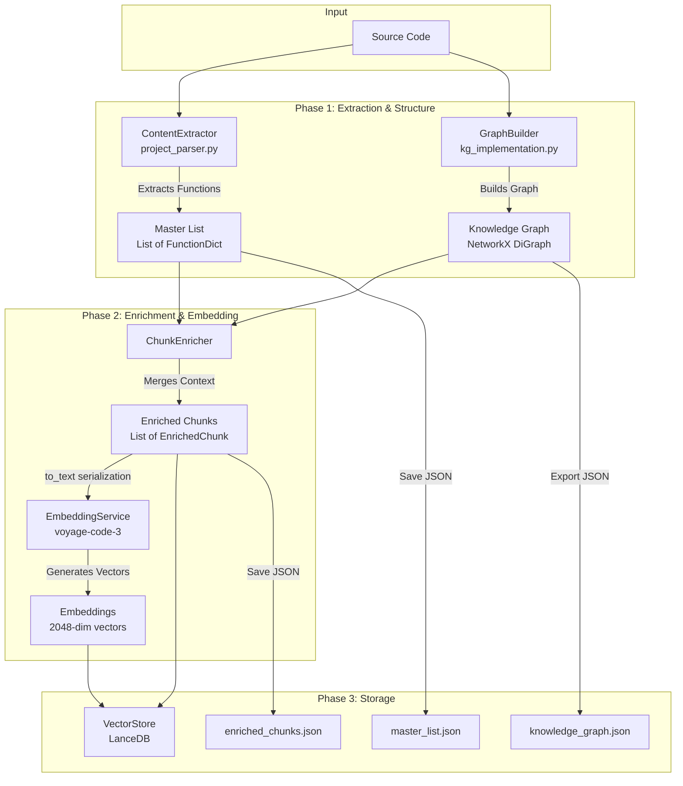
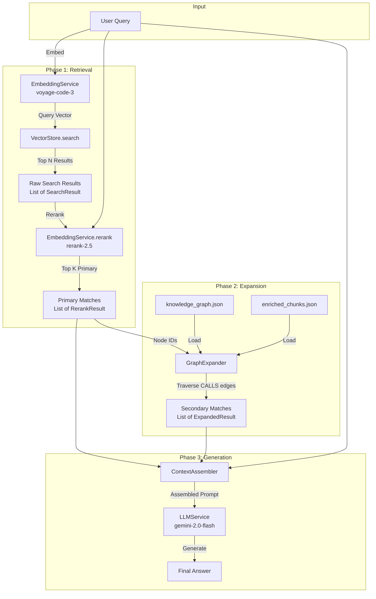

# Graph-Enhanced RAG Workflow

This document outlines the workflow of the Graph-Enhanced Retrieval-Augmented Generation (RAG) system. The system consists of two main phases: **Indexing** and **Querying**.

## 1. Indexing Pipeline

The indexing pipeline transforms a raw codebase into a structured, searchable knowledge base combining vector embeddings and graph relationships.



### Indexing Steps

| Step | Component | Input | Output | Description |
|------|-----------|-------|--------|-------------|
| 1 | `ContentExtractor` | Project path | `List[FunctionDict]` | Parses codebase using tree-sitter to extract functions, classes, and metadata |
| 2 | `GraphBuilder` | Project path | `nx.DiGraph` | Builds knowledge graph with File, Class/Contract, Function, and External nodes |
| 3 | `ChunkEnricher` | Graph + Master List | `List[EnrichedChunk]` | Merges code with graph context (Defined_In, Calls, Called_By). Splits large chunks. |
| 4 | `EmbeddingService` | Chunk texts | `List[List[float]]` | Generates 2048-dim embeddings using `voyage-code-3` with batch processing |
| 5 | `VectorStore` | Chunks + Embeddings | LanceDB table | Stores in `code_embeddings` table with vector, text, node_id, filename |
| 6 | `GraphBuilder` | Graph | JSON files | Exports graph, master list, and enriched chunks to JSON |

### Graph Structure

The knowledge graph contains:

**Node Types:**
- `File`: Source files with `name`, `path`
- `Class/Contract`: Classes/contracts with `name`, `file_path`
- `Function`: Functions with `label`, `file_path`, `line_number`, `content`
- `External`: Unresolved external calls with `name`

**Edge Types:**
- `DEFINES`: Containment (File→Class, Class→Function, File→Function)
- `CALLS`: Invocation relationships (Function→Function, Function→External)

### EnrichedChunk Format

Each chunk is serialized with three sections:

```
[METADATA]
File: /path/to/file.py
Function: ClassName.method_name
Type: Function
Node_ID: Function:/path:name:line
Chunk_ID: (for split chunks)
Parent_Doc_ID: (for split chunks)
Chunk_Order: (for split chunks)

[CONTEXT]
Defined_In: ClassName
Calls: helper_func, utils.process
Called_By: main, test_method

[CODE]
def method_name(self, arg1, arg2):
    ...
```

---

## 2. Querying Pipeline

The querying pipeline retrieves relevant code using a hybrid approach of vector search and graph traversal, then generates an answer using an LLM.



### Querying Steps

| Step | Component | Input | Output | Description |
|------|-----------|-------|--------|-------------|
| 1 | `EmbeddingService` | Query string | `List[float]` | Embeds query using `voyage-code-3` with `input_type="query"` |
| 2 | `VectorStore` | Query embedding | `List[SearchResult]` | Retrieves top N similar chunks from LanceDB |
| 3 | `EmbeddingService` | Query + Documents | `List[RerankResult]` | Reranks using `rerank-2.5` model for improved precision |
| 4 | `GraphExpander` | Node IDs | `List[ExpandedResult]` | Traverses CALLS edges (both directions) to find related code |
| 5 | `ContextAssembler` | Primary + Secondary + Query | Prompt string | Assembles structured prompt with sections |
| 6 | `LLMService` | Prompt | Response string | Generates answer using `gemini-2.0-flash` |

### Graph Expansion Details

The `GraphExpander` finds related code by:

1. Taking node IDs from primary search results
2. Traversing outgoing `CALLS` edges → functions this code calls
3. Traversing incoming `CALLS` edges → functions that call this code
4. Skipping `External` nodes (unresolved calls)
5. Retrieving source code from enriched chunks or master list
6. Filtering out nodes already in primary results

### Context Assembly Format

The `ContextAssembler` creates a structured prompt:

```
You are a coding assistant. Answer the question based on the following context.

--- PRIMARY MATCHES ---
[Chunk 1]
<enriched chunk text>

[Chunk 2]
<enriched chunk text>

--- RELATED CODE (Dependencies) ---
[Dep 1]
<expanded context>

[Dep 2]
<expanded context>

Question: <user query>
```

---

## 3. Error Handling

The pipeline uses a hierarchical exception system:

| Exception | Stage | Description |
|-----------|-------|-------------|
| `PipelineError` | Base | Base class with `stage`, `message`, `original_error` |
| `ExtractionError` | extraction | Content extraction failures |
| `GraphBuildError` | graph_building | Graph construction failures |
| `EnrichmentError` | enrichment | Chunk enrichment failures |
| `EmbeddingError` | embedding | Embedding generation failures |
| `StorageError` | storage | LanceDB or file I/O failures |
| `RetrievalError` | retrieval | Search or rerank failures |
| `GenerationError` | generation | LLM generation failures |
| `IndexNotFoundError` | retrieval | Missing index files |

### Graceful Degradation

The query pipeline handles failures gracefully:
- **Reranking fails**: Falls back to raw vector search results
- **Graph expansion fails**: Continues with primary results only
- **LLM generation fails**: Returns context without response (`success=False`)

---

## 4. API Rate Limiting

Both `EmbeddingService` and `LLMService` implement exponential backoff retry:

- **Max retries**: 5
- **Delays**: 2s, 4s, 8s, 16s, 32s
- **Triggers**: HTTP 429, rate limit, quota exceeded errors

Embedding uses batch processing (default 100 texts per batch) to respect API limits.
